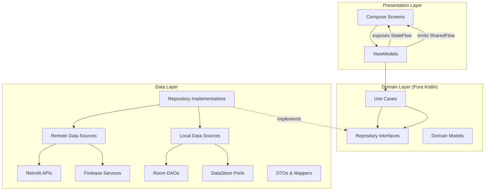

# Implementation Plan: NomNow Client App — MVVM Architecture (Fresh Start)

> **Scope**: Customer-facing app **only** (Restaurant & Driver apps will be planned separately)
> **Architecture**: MVVM with Clean Architecture layers (Presentation → Domain → Data)
> **Source**: [spec.md](file:///F:/Android%20Projects/Candroid/NomNow/specs/001-nomnow-food-delivery/spec.md), [plan.md](file:///F:/Android%20Projects/Candroid/NomNow/specs/001-nomnow-food-delivery/plan.md), [data-model.md](file:///F:/Android%20Projects/Candroid/NomNow/specs/001-nomnow-food-delivery/data-model.md), [tasks.md](file:///F:/Android%20Projects/Candroid/NomNow/specs/001-nomnow-food-delivery/tasks.md)
> **Date**: 2026-06-21

---
-
## Summary

This plan creates the NomNow **Customer App** from the existing empty starter project. We follow MVVM + Clean Architecture with three clear layers: **Presentation** (Compose Screens + ViewModels using StateFlow), **Domain** (Use Cases + Repository interfaces + pure Kotlin models), and **Data** (Repository implementations + Retrofit/Firebase remote + Room local). The project uses a single `:app` module with package-by-layer at the top level and package-by-feature within each layer. All external services (Firebase Auth, Firestore, MockAPI, PayMob, Google Maps) are abstracted behind repository interfaces so they can be swapped without touching the UI.

> [!IMPORTANT]
> This plan covers the **Customer App** only (User Stories 1, 4, 5, 6 from the spec). Restaurant (US2) and Driver (US3) apps will be planned in a subsequent request to conserve tokens.

---

## Current State

The existing project is a **default Android Studio Compose starter**:
- Single `:app` module with `com.nomnow.app` package
- `MainActivity.kt` with "Hello Android!" greeting
- Default Material3 theme (Color.kt, Theme.kt, Type.kt)
- Compose BOM `2024.04.01`, Kotlin `2.0.0`, AGP `8.7.3`
- **No** ViewModels, repositories, DI, navigation, networking, or Room
- Previous spec-kit work scaffolded files under `com.nomnow.*` and `com.android.nomnow.*` — these are marked `[x]` in tasks.md but we'll need to verify/clean up since this is a fresh MVVM learning project

---

## Architecture Overview: MVVM + Clean Architecture



### Key MVVM Principles Enforced

| Principle | How It's Applied |
|-----------|-----------------|
| **Unidirectional Data Flow** | ViewModel exposes `StateFlow<UiState>` (read-only). Screens observe state and dispatch user actions as function calls. |
| **Separation of Concerns** | Screens only render UI. ViewModels contain logic. Use Cases encapsulate business rules. Repositories abstract data access. |
| **Testability** | Domain layer is pure Kotlin (no Android deps). ViewModels tested with fake repos. Screens tested with Compose Test. |
| **Dependency Injection** | **Manual DI** via a centralized `AppContainer` class initially. Repository interfaces injected into Use Cases, Use Cases into ViewModels via constructor injection and custom `ViewModelProvider.Factory`. Hilt migration deferred to Phase 12. |
| **Lifecycle Awareness** | ViewModels survive configuration changes. Flows collected with `collectAsStateWithLifecycle()`. |

---

## Client App Target Package Structure

```text
app/src/main/java/com/nomnow/
├── NomNowApp.kt                     # Application class (creates AppContainer)
├── MainActivity.kt                   # Single Activity, hosts NavHost
│
├── core/                             # Shared infrastructure
│   ├── di/                           # Manual DI container
│   │   └── AppContainer.kt           # Centralized dependency graph (manual wiring)
│   ├── network/
│   │   ├── RetrofitClient.kt         # Base URL, converters, interceptors
│   │   ├── AuthInterceptor.kt        # Attaches Firebase ID token
│   │   └── NetworkMonitor.kt         # ConnectivityManager Flow
│   ├── local/
│   │   ├── AppDatabase.kt            # Room database definition
│   │   ├── converters/
│   │   │   └── ListConverters.kt     # Type converters for Room
│   │   ├── OnboardingPreferences.kt  # DataStore: first-launch flag
│   │   ├── SessionPreferences.kt     # DataStore: auth session
│   │   └── ThemePreferences.kt       # DataStore: dark/light mode
│   └── utils/
│       ├── Result.kt                 # Sealed class: Success/Error/Loading
│       ├── Constants.kt              # API URLs, keys, magic values
│       ├── Extensions.kt             # Kotlin extension functions
│       └── CoroutineDispatchers.kt   # Injectable dispatchers for testing
│
├── data/                             # Data layer implementations
│   ├── remote/
│   │   ├── api/
│   │   │   ├── RestaurantApi.kt      # Retrofit: restaurants & menus
│   │   │   ├── CategoryApi.kt        # Retrofit: categories & banners
│   │   │   └── PaymentApi.kt         # PayMob payment API
│   │   ├── firebase/
│   │   │   ├── AuthRemoteDataSource.kt      # Firebase Auth operations
│   │   │   ├── UserFirestoreDataSource.kt   # Firestore: user profiles
│   │   │   └── OrderFirestoreDataSource.kt  # Firestore: order CRUD + listeners
│   │   ├── dto/
│   │   │   ├── RestaurantDto.kt
│   │   │   ├── MenuItemDto.kt
│   │   │   ├── CategoryDto.kt
│   │   │   ├── BannerDto.kt
│   │   │   └── OrderDto.kt
│   │   └── mapper/
│   │       └── DtoMappers.kt         # DTO ↔ Domain model mappers
│   ├── local/
│   │   ├── dao/
│   │   │   ├── CartDao.kt            # Room: cart item CRUD
│   │   │   ├── RestaurantCacheDao.kt # Room: cached restaurants
│   │   │   └── SearchHistoryDao.kt   # Room: recent searches
│   │   └── entity/
│   │       ├── CartItemEntity.kt
│   │       ├── RestaurantCacheEntity.kt
│   │       └── SearchHistoryEntity.kt
│   └── repository/
│       ├── AuthRepositoryImpl.kt
│       ├── RestaurantRepositoryImpl.kt
│       ├── CartRepositoryImpl.kt
│       ├── OrderRepositoryImpl.kt
│       └── UserRepositoryImpl.kt
│
├── domain/                           # Pure Kotlin domain layer
│   ├── model/
│   │   ├── User.kt                   # data class + UserRole enum
│   │   ├── Address.kt
│   │   ├── Restaurant.kt
│   │   ├── MenuItem.kt               # + CustomizationGroup, CustomizationOption
│   │   ├── MenuCategory.kt
│   │   ├── CartItem.kt
│   │   ├── Order.kt                  # + OrderItem, OrderStatus, OrderType enums
│   │   ├── Category.kt               # Home screen filter
│   │   ├── Banner.kt                 # Promo carousel
│   │   └── DriverLocation.kt         # For tracking map
│   ├── repository/                   # Interfaces only (contracts)
│   │   ├── AuthRepository.kt
│   │   ├── RestaurantRepository.kt
│   │   ├── CartRepository.kt
│   │   ├── OrderRepository.kt
│   │   └── UserRepository.kt
│   └── usecase/
│       ├── auth/
│       │   ├── SignInUseCase.kt
│       │   ├── SignUpUseCase.kt
│       │   ├── SignOutUseCase.kt
│       │   ├── ForgotPasswordUseCase.kt
│       │   └── ObserveSessionUseCase.kt
│       ├── restaurant/
│       │   ├── GetRestaurantsUseCase.kt
│       │   ├── GetRestaurantDetailsUseCase.kt
│       │   ├── SearchRestaurantsUseCase.kt
│       │   ├── GetCategoriesUseCase.kt
│       │   └── GetOffersUseCase.kt
│       ├── cart/
│       │   ├── AddToCartUseCase.kt
│       │   ├── RemoveFromCartUseCase.kt
│       │   ├── UpdateCartQuantityUseCase.kt
│       │   ├── GetCartUseCase.kt
│       │   ├── ClearCartUseCase.kt
│       │   └── ApplyPromoCodeUseCase.kt
│       ├── order/
│       │   ├── PlaceOrderUseCase.kt
│       │   ├── GetOrderStatusUseCase.kt
│       │   └── GetOrderHistoryUseCase.kt
│       └── profile/
│           ├── GetProfileUseCase.kt
│           ├── SaveAddressUseCase.kt
│           ├── GetSavedAddressesUseCase.kt
│           └── ToggleThemeUseCase.kt
│
└── presentation/                     # Compose UI + ViewModels
    ├── theme/
    │   ├── Color.kt                  # Dark & Light color tokens
    │   ├── Typography.kt             # 11 text styles
    │   ├── Spacing.kt                # Spacing scale + CompositionLocal
    │   ├── Shapes.kt                 # Corner radius scale
    │   └── NomNowTheme.kt            # Theme wrapper composable
    ├── components/                   # Reusable design system components
    │   ├── NomButton.kt
    │   ├── NomTextField.kt
    │   ├── NomCard.kt
    │   ├── NomChip.kt
    │   ├── NomBadge.kt
    │   ├── NomQuantityStepper.kt
    │   ├── ShimmerSkeleton.kt
    │   ├── NomBottomSheet.kt
    │   ├── NomSnackbar.kt
    │   ├── NomOrderStepper.kt
    │   ├── NomRating.kt
    │   ├── OfflineBanner.kt
    │   └── EmptyState.kt
    ├── navigation/
    │   ├── NomNavHost.kt             # Top-level NavHost
    │   ├── AuthNavGraph.kt           # Auth flow routes
    │   ├── CustomerNavGraph.kt       # Customer tab routes
    │   └── Route.kt                  # Sealed class of all routes
    ├── common/
    │   ├── UiEvent.kt                # One-shot events (Snackbar, Navigate)
    │   └── UiState.kt                # Generic loading/success/error wrapper
    ├── auth/
    │   ├── signin/
    │   │   ├── SignInScreen.kt
    │   │   └── SignInViewModel.kt
    │   └── signup/
    │       ├── SignUpScreen.kt
    │       └── SignUpViewModel.kt
    ├── onboarding/
    │   ├── SplashScreen.kt
    │   ├── OnboardingScreen.kt
    │   └── OnboardingViewModel.kt
    └── customer/
        ├── home/
        │   ├── HomeScreen.kt
        │   └── HomeViewModel.kt
        ├── search/
        │   ├── SearchScreen.kt
        │   └── SearchViewModel.kt
        ├── restaurant/
        │   ├── RestaurantDetailsScreen.kt
        │   ├── RestaurantDetailsViewModel.kt
        │   └── ItemDetailSheet.kt
        ├── cart/
        │   ├── CartScreen.kt
        │   ├── CartViewModel.kt
        │   ├── ClearCartDialog.kt
        │   └── CheckoutWebViewScreen.kt
        ├── orderstatus/
        │   ├── OrderStatusScreen.kt
        │   ├── OrderStatusViewModel.kt
        │   └── LiveMapScreen.kt
        ├── orders/
        │   ├── OrderHistoryScreen.kt
        │   └── OrderHistoryViewModel.kt
        ├── profile/
        │   ├── ProfileScreen.kt
        │   ├── ProfileViewModel.kt
        │   └── AddressPickerScreen.kt
        └── CustomerBottomBar.kt
```

---

## Open Questions

> [!IMPORTANT]
> **Q1**: The existing project has scaffolded files under both `com.nomnow.*` and `com.android.nomnow.*` from previous spec-kit runs. Should we **clean up both and start fresh** with a single `com.nomnow.app` base package, or keep the existing files and build on top?

> [!IMPORTANT]
> **Q2**: The spec defines `minSdk 26` and `targetSdk 36` in plan.md but the current `build.gradle.kts` has `minSdk 24` and `targetSdk 35`. Which should we use? I recommend **minSdk 26 / targetSdk 35** (26 enables several APIs like `createNotificationChannel` without compat checks).

> [!IMPORTANT]
> **Q3**: For the learning project — should we set up **Firebase immediately** (requires `google-services.json`) or use **mock/fake implementations** of auth and Firestore initially so you can focus on the MVVM architecture patterns first?

> [!WARNING]
> **Q4**: The spec has `applicationId = com.nomnow.app` but the plan.md package structure uses `com.nomnow`. Should the root package be `com.nomnow` (matching plan.md) or `com.nomnow.app` (matching current build.gradle.kts)?

---

## Proposed Changes — Phases & Tasks

---

## 🔵 Phase 1: Project Foundation & Build Configuration
**Goal**: Transform the empty starter into a properly configured MVVM-ready project
**Estimated Files**: ~8 files
**Depends On**: Nothing — this is the starting point

---

### Phase 1A: Gradle & Dependencies

#### [MODIFY] [libs.versions.toml](file:///F:/Android%20Projects/Candroid/NomNow/gradle/libs.versions.toml)
Add all required dependency versions and libraries:
- **Navigation**: Compose Navigation 2.8+
- **DI**: ~~Hilt deferred to Phase 12~~ — Manual DI initially (no extra library needed)
- **Networking**: Retrofit 2.11+, OkHttp 4.12+, Gson converter
- **Database**: Room 2.6+
- **Firebase**: BOM (Auth, Firestore, Realtime DB, FCM, Storage)
- **Images**: Coil-compose 2.7+
- **Maps**: Google Maps Compose
- **DataStore**: Preferences DataStore
- **Testing**: JUnit 5, MockK, Compose UI Test, Espresso
- **Lifecycle**: ViewModel Compose, runtime-compose

#### [MODIFY] [build.gradle.kts](file:///F:/Android%20Projects/Candroid/NomNow/build.gradle.kts) (root)
- Add KSP (for Room) and Google Services plugin declarations (apply false)
- **Note**: Hilt plugin deferred to Phase 12

#### [MODIFY] [settings.gradle.kts](file:///F:/Android%20Projects/Candroid/NomNow/settings.gradle.kts)
- Ensure Google repository is included for Firebase and Maps SDKs

#### [MODIFY] [app/build.gradle.kts](file:///F:/Android%20Projects/Candroid/NomNow/app/build.gradle.kts)
- Apply KSP (for Room), Google Services plugins — **no Hilt plugin yet**
- Enable `buildConfig = true` for API key management
- Set `minSdk` / `targetSdk` per decision on Q2
- Add all library dependencies from version catalog (excluding Hilt)
- Configure JUnit 5 test runner
- Add signing config placeholders for release

---

### Phase 1B: App Shell & Manifest

#### [MODIFY] [AndroidManifest.xml](file:///F:/Android%20Projects/Candroid/NomNow/app/src/main/AndroidManifest.xml)
- Add permissions: INTERNET, ACCESS_NETWORK_STATE, ACCESS_FINE_LOCATION, ACCESS_COARSE_LOCATION
- Configure `MainActivity` as singleTop with deep link intent filters
- Add `NomNowApp` as the application class

#### [NEW] `NomNowApp.kt` — `app/src/main/java/com/nomnow/NomNowApp.kt`
- Plain `Application()` subclass (**no** `@HiltAndroidApp` — deferred to Phase 12)
- Creates and holds the `AppContainer` singleton (the manual DI graph)
- Initialize Coil image loader with disk cache

#### [MODIFY] [MainActivity.kt](file:///F:/Android%20Projects/Candroid/NomNow/app/src/main/java/com/nomnow/app/MainActivity.kt)
- Move to `com.nomnow` package (or keep per Q4 decision)
- **No** `@AndroidEntryPoint` annotation (deferred to Phase 12)
- Access `AppContainer` from `(application as NomNowApp).appContainer`
- Set content to `NomNowTheme { NomNavHost(appContainer) }`
- Edge-to-edge setup

**✅ Checkpoint 1A/1B**: Project builds with all dependencies resolved. `./gradlew assembleDebug` passes.

---

## 🔵 Phase 2: Core Infrastructure (MVVM Foundation)
**Goal**: Build the shared utilities, DI modules, and data layer plumbing that all features depend on
**Depends On**: Phase 1
**Estimated Files**: ~25 files

---

### Phase 2A: Core Utilities (3 files)

| Task | File | Description |
|------|------|-------------|
| 2A.1 | [NEW] `core/utils/Result.kt` | Sealed class: `Success<T>`, `Error(exception, message)`, `Loading`. Extension functions `toResult()`, `mapResult()` |
| 2A.2 | [NEW] `core/utils/Constants.kt` | API base URLs, cache TTL (30 min), promo code "NOMNOW20", delivery fee defaults |
| 2A.3 | [NEW] `core/utils/CoroutineDispatchers.kt` | Injectable `DispatcherProvider` interface + `DefaultDispatchers` impl (testable) |

### Phase 2B: Local Storage — DataStore Preferences (3 files)

| Task | File | Description |
|------|------|-------------|
| 2B.1 | [NEW] `core/local/OnboardingPreferences.kt` | DataStore boolean: `has_completed_onboarding`. Exposes `Flow<Boolean>` + suspend `setCompleted()` |
| 2B.2 | [NEW] `core/local/SessionPreferences.kt` | DataStore: user ID, role, auth token. Exposes `Flow<SessionData?>` + save/clear |
| 2B.3 | [NEW] `core/local/ThemePreferences.kt` | DataStore: dark mode toggle. Exposes `Flow<Boolean>` + suspend `toggleTheme()` |

### Phase 2C: Domain Models (10 files)

All pure Kotlin data classes — **no Android dependencies**.

| Task | File | Key Fields |
|------|------|------------|
| 2C.1 | [NEW] `domain/model/User.kt` | uid, fullName, email, phone?, role: UserRole, profileImageUrl?, savedAddresses |
| 2C.2 | [NEW] `domain/model/Address.kt` | label?, fullAddress, city, latitude, longitude |
| 2C.3 | [NEW] `domain/model/Restaurant.kt` | id, name, description, imageUrl, cuisineTypes, rating, reviewCount, deliveryTime, deliveryFee, minOrder, isOpen, address |
| 2C.4 | [NEW] `domain/model/MenuCategory.kt` | id, name, sortOrder |
| 2C.5 | [NEW] `domain/model/MenuItem.kt` | id, restaurantId, name, description, imageUrl, priceEgp, category, isAvailable, customizationGroups. Nested: CustomizationGroup, CustomizationOption |
| 2C.6 | [NEW] `domain/model/CartItem.kt` | id, menuItemId, restaurantId, name, imageUrl, basePrice, selectedOptions, optionsAdditionalPrice, quantity, note. Computed: `totalPrice` |
| 2C.7 | [NEW] `domain/model/Order.kt` | id, customerId, restaurantId, restaurantName, items: List<OrderItem>, deliveryAddress, orderType, status: OrderStatus, pricing fields, timestamps. Nested: OrderItem. Enums: OrderStatus, OrderType |
| 2C.8 | [NEW] `domain/model/Category.kt` | id, name, iconUrl? |
| 2C.9 | [NEW] `domain/model/Banner.kt` | id, imageUrl, title, subtitle?, promoCode? |
| 2C.10 | [NEW] `domain/model/DriverLocation.kt` | lat, lng, timestamp, activeOrderId? |

### Phase 2D: Repository Interfaces (5 files)

Pure Kotlin interfaces — contracts for the data layer.

| Task | File | Key Methods |
|------|------|-------------|
| 2D.1 | [NEW] `domain/repository/AuthRepository.kt` | `signIn()`, `signUp()`, `signOut()`, `observeSession()`, `forgotPassword()`, `googleSignIn()` |
| 2D.2 | [NEW] `domain/repository/RestaurantRepository.kt` | `getRestaurants()`, `getRestaurantDetails()`, `searchRestaurants()`, `getCategories()`, `getOffers()` |
| 2D.3 | [NEW] `domain/repository/CartRepository.kt` | `getCart()`, `addItem()`, `removeItem()`, `updateQuantity()`, `clearCart()`, `getCartFlow()` |
| 2D.4 | [NEW] `domain/repository/OrderRepository.kt` | `placeOrder()`, `observeOrderStatus()`, `getOrderHistory()`, `reorder()` |
| 2D.5 | [NEW] `domain/repository/UserRepository.kt` | `getProfile()`, `updateProfile()`, `saveAddress()`, `deleteAddress()`, `getSavedAddresses()` |

### Phase 2E: Room Database Setup (7 files)

| Task | File | Description |
|------|------|-------------|
| 2E.1 | [NEW] `core/local/converters/ListConverters.kt` | TypeConverters for `List<String>` ↔ JSON string |
| 2E.2 | [NEW] `data/local/entity/CartItemEntity.kt` | Room entity mirroring CartItem with all fields |
| 2E.3 | [NEW] `data/local/entity/RestaurantCacheEntity.kt` | Restaurant + `cachedAt: Long` for TTL invalidation |
| 2E.4 | [NEW] `data/local/entity/SearchHistoryEntity.kt` | query, searchedAt, auto-PK |
| 2E.5 | [NEW] `data/local/dao/CartDao.kt` | `@Dao` — insert, update, delete, getAll as Flow, clearAll, getByRestaurantId |
| 2E.6 | [NEW] `data/local/dao/RestaurantCacheDao.kt` | `@Dao` — insertAll, getAll, getById, deleteExpired(threshold), clearAll |
| 2E.7 | [NEW] `data/local/dao/SearchHistoryDao.kt` | `@Dao` — insert, getRecent(limit=10), delete, clearAll |
| 2E.8 | [NEW] `core/local/AppDatabase.kt` | `@Database` — entities: CartItemEntity, RestaurantCacheEntity, SearchHistoryEntity. DAOs exposed. |

### Phase 2F: Networking Setup (5 files)

| Task | File | Description |
|------|------|-------------|
| 2F.1 | [NEW] `core/network/RetrofitClient.kt` | Base Retrofit builder with Gson converter, logging interceptor, 30s timeout |
| 2F.2 | [NEW] `core/network/AuthInterceptor.kt` | OkHttp interceptor: attaches Firebase ID token from `SessionPreferences` |
| 2F.3 | [NEW] `core/network/NetworkMonitor.kt` | `ConnectivityManager.NetworkCallback` → `StateFlow<Boolean>` for online/offline |
| 2F.4 | [NEW] `data/remote/api/RestaurantApi.kt` | Retrofit interface: `@GET restaurants`, `@GET restaurants/{id}`, `@GET restaurants/{id}/menu`, `@GET categories`, `@GET banners` |
| 2F.5 | [NEW] `data/remote/api/CategoryApi.kt` | Retrofit interface: `@GET categories` |

### Phase 2G: DTOs & Mappers (6 files)

| Task | File | Description |
|------|------|-------------|
| 2G.1 | [NEW] `data/remote/dto/RestaurantDto.kt` | Matches MockAPI JSON structure |
| 2G.2 | [NEW] `data/remote/dto/MenuItemDto.kt` | Includes nested customization DTOs |
| 2G.3 | [NEW] `data/remote/dto/CategoryDto.kt` | Simple id/name/icon DTO |
| 2G.4 | [NEW] `data/remote/dto/BannerDto.kt` | Promotional banner DTO |
| 2G.5 | [NEW] `data/remote/dto/OrderDto.kt` | Order Firestore document DTO |
| 2G.6 | [NEW] `data/remote/mapper/DtoMappers.kt` | Extension functions: `RestaurantDto.toDomain()`, `MenuItemDto.toDomain()`, etc. + reverse mappers `CartItem.toEntity()`, `CartItemEntity.toDomain()` |

### Phase 2H: Manual DI Container (1 file)

| Task | File | Description |
|------|------|-------------|
| 2H.1 | [NEW] `core/di/AppContainer.kt` | Centralized manual dependency injection container. Lazily creates and holds all singletons: OkHttpClient, Retrofit, API interfaces, Room DB + DAOs, Firebase instances (Auth, Firestore, RTDB, FCM), DataStore preferences, all Repository implementations (bound to interfaces), all Use Cases, and `DispatcherProvider`. ViewModels obtain dependencies from this container via custom `ViewModelProvider.Factory` instances. |

**Example `AppContainer` structure:**
```kotlin
class AppContainer(private val context: Context) {
    // Network
    val okHttpClient: OkHttpClient by lazy { /* build */ }
    val retrofit: Retrofit by lazy { /* build with okHttpClient */ }
    val restaurantApi: RestaurantApi by lazy { retrofit.create(RestaurantApi::class.java) }
    
    // Database
    val database: AppDatabase by lazy { Room.databaseBuilder(context, AppDatabase::class.java, "nomnow.db").build() }
    val cartDao: CartDao by lazy { database.cartDao() }
    
    // Firebase
    val firebaseAuth: FirebaseAuth by lazy { FirebaseAuth.getInstance() }
    val firestore: FirebaseFirestore by lazy { FirebaseFirestore.getInstance() }
    
    // Repositories (interface = implementation)
    val authRepository: AuthRepository by lazy { AuthRepositoryImpl(authRemoteDataSource, userFirestoreDataSource, sessionPreferences) }
    val restaurantRepository: RestaurantRepository by lazy { RestaurantRepositoryImpl(restaurantApi, restaurantCacheDao, dispatchers) }
    val cartRepository: CartRepository by lazy { CartRepositoryImpl(cartDao) }
    val orderRepository: OrderRepository by lazy { OrderRepositoryImpl(orderFirestoreDataSource) }
    val userRepository: UserRepository by lazy { UserRepositoryImpl(userFirestoreDataSource) }
    
    // Use Cases
    val signInUseCase: SignInUseCase by lazy { SignInUseCase(authRepository) }
    // ... etc.
}
```

> [!TIP]
> **Why Manual DI first?** Understanding how dependencies are wired by hand makes the "magic" of Hilt/Dagger much clearer when we migrate in Phase 12. You'll appreciate `@Inject`, `@Singleton`, and `@Binds` much more after building the graph manually.

**✅ Checkpoint Phase 2**: All core infrastructure compiles. Domain models, repository interfaces, Room DB, Retrofit APIs, and manual DI container are wired. `./gradlew assembleDebug` passes.

---

## 🟢 Phase 3: Design System — Theme & Components
**Goal**: Implement the complete "Warm Minimalist Premium" design system
**Depends On**: Phase 1 (builds on Compose setup)
**Can run in parallel with**: Phase 2 (no dependencies between them)
**Estimated Files**: ~18 files

---

### Phase 3A: Theme Tokens (5 files)

| Task | File | Description |
|------|------|-------------|
| 3A.1 | [NEW] `presentation/theme/Color.kt` | Complete dark & light color schemes with all 15 tokens from spec (background, surface, surfaceElevated, primary, primaryVariant, primarySubtle, onPrimary, textPrimary, textSecondary, border, success, error, warning, onSurface, scrim) |
| 3A.2 | [NEW] `presentation/theme/Typography.kt` | All 11 text styles (displayLarge → caption) using Plus Jakarta Sans + Inter fonts. Custom `FontFamily` definitions with bundled font files. |
| 3A.3 | [NEW] `presentation/theme/Spacing.kt` | Spacing object with space2→space64. Exposed via `LocalSpacing` CompositionLocal + `MaterialTheme.spacing` extension. |
| 3A.4 | [NEW] `presentation/theme/Shapes.kt` | Radius tokens: radiusXSmall→radiusFull. Custom `LocalRadii` CompositionLocal. |
| 3A.5 | [NEW] `presentation/theme/NomNowTheme.kt` | Theme wrapper: wires ColorScheme, Typography, Shapes, Spacing. Reads `ThemePreferences` for dark/light. `@Preview` for both themes. |

> **Font files**: Download Plus Jakarta Sans and Inter to `res/font/`. 4 weight variants each.

### Phase 3B: Design System Components (13 files)

Each component follows spec.md §Component Specifications exactly.

| Task | File | Key Specs |
|------|------|-----------|
| 3B.1 | [NEW] `presentation/components/NomButton.kt` | 4 variants (Primary/Secondary/Ghost/Destructive), 3 sizes (56/44/36dp), loading state, disabled (38% opacity), 0.98 scale press |
| 3B.2 | [NEW] `presentation/components/NomTextField.kt` | 56dp height, floating label animation, 4 states, password toggle, inline error |
| 3B.3 | [NEW] `presentation/components/NomCard.kt` | Default/Elevated/Interactive, dark=border only, light=shadow only, 0.98 press for interactive |
| 3B.4 | [NEW] `presentation/components/NomChip.kt` | 36dp, radiusFull, active/inactive states, optional leading icon |
| 3B.5 | [NEW] `presentation/components/NomBadge.kt` | Status/Count/Discount variants with correct colors |
| 3B.6 | [NEW] `presentation/components/NomQuantityStepper.kt` | 36dp, radiusFull, min=1 disabled, spring scale 1.2→1.0 animation |
| 3B.7 | [NEW] `presentation/components/ShimmerSkeleton.kt` | 1400ms loop, 15° gradient, Card/ListItem/Banner variants |
| 3B.8 | [NEW] `presentation/components/NomBottomSheet.kt` | radiusXLarge top, handle bar, spring entry, scrim dismiss |
| 3B.9 | [NEW] `presentation/components/NomSnackbar.kt` | Success/Error/Info, 3s auto-dismiss, spring slide-up |
| 3B.10 | [NEW] `presentation/components/NomOrderStepper.kt` | Vertical timeline, Completed/Active(pulsing)/Upcoming, checkmark path draw |
| 3B.11 | [NEW] `presentation/components/NomRating.kt` | Display (20dp stars) + Interactive input (32dp stars) |
| 3B.12 | [NEW] `presentation/components/OfflineBanner.kt` | Persistent top banner with offline message |
| 3B.13 | [NEW] `presentation/components/EmptyState.kt` | Illustration + message + retry button |

**✅ Checkpoint Phase 3**: All theme tokens and components render correctly in `@Preview` for both dark and light themes. No hardcoded colors, spacing, or typography.

---

## 🟡 Phase 4: Authentication Feature (MVVM Pattern Demo)
**Goal**: Implement the full auth flow as the first end-to-end MVVM feature
**Depends On**: Phase 2 (Core infrastructure) + Phase 3 (Design system)
**Estimated Files**: ~15 files

> [!TIP]
> This is the **first feature that demonstrates the complete MVVM pattern** — data sources → repository → use cases → ViewModel → Screen. Pay extra attention to understanding the data flow.

---

### Phase 4A: Data Layer — Auth (3 files)

| Task | File | Description |
|------|------|-------------|
| 4A.1 | [NEW] `data/remote/firebase/AuthRemoteDataSource.kt` | Wraps Firebase Auth: `signInWithEmail()`, `createUser()`, `signOut()`, `sendPasswordReset()`, `googleSignIn()`, `getCurrentUser()`, `getIdToken()` |
| 4A.2 | [NEW] `data/remote/firebase/UserFirestoreDataSource.kt` | Wraps Firestore `users` collection: `createUser()`, `getUser()`, `updateUser()`, `updateFcmToken()` |
| 4A.3 | [NEW] `data/repository/AuthRepositoryImpl.kt` | Implements `AuthRepository`. Coordinates Auth + Firestore + SessionPreferences. On sign-in: authenticate → fetch user doc → save session → return User. On sign-out: clear session → Firebase sign out. |

### Phase 4B: Domain Layer — Auth Use Cases (5 files)

| Task | File | Logic |
|------|------|-------|
| 4B.1 | [NEW] `domain/usecase/auth/SignInUseCase.kt` | Validates email format → calls `authRepository.signIn()` → returns `Result<User>` |
| 4B.2 | [NEW] `domain/usecase/auth/SignUpUseCase.kt` | Validates all fields (name, email, password strength, confirm match) → calls `authRepository.signUp()` → returns `Result<User>` |
| 4B.3 | [NEW] `domain/usecase/auth/SignOutUseCase.kt` | Calls `authRepository.signOut()` → clears local data |
| 4B.4 | [NEW] `domain/usecase/auth/ForgotPasswordUseCase.kt` | Validates email → calls `authRepository.forgotPassword()` |
| 4B.5 | [NEW] `domain/usecase/auth/ObserveSessionUseCase.kt` | Returns `Flow<SessionData?>` from `SessionPreferences` for auto-login check |

### Phase 4C: Presentation Layer — Auth Screens (7 files)

#### ViewModel UiState Pattern (applied to all ViewModels):
```kotlin
// Each ViewModel follows this exact pattern:
data class SignInUiState(
    val email: String = "",
    val password: String = "",
    val emailError: String? = null,
    val passwordError: String? = null,
    val isLoading: Boolean = false,
)

sealed class SignInUiEvent {
    data class ShowSnackbar(val message: String) : SignInUiEvent()
    data class NavigateTo(val route: String) : SignInUiEvent()
}

// No @HiltViewModel — using manual ViewModelProvider.Factory (Hilt migration in Phase 12)
class SignInViewModel(
    private val signInUseCase: SignInUseCase,
) : ViewModel() {
    private val _uiState = MutableStateFlow(SignInUiState())
    val uiState: StateFlow<SignInUiState> = _uiState.asStateFlow()

    private val _uiEvent = MutableSharedFlow<SignInUiEvent>()
    val uiEvent: SharedFlow<SignInUiEvent> = _uiEvent.asSharedFlow()

    fun onEmailChanged(email: String) { _uiState.update { it.copy(email = email) } }
    fun onPasswordChanged(password: String) { ... }
    fun onSignInClick() { viewModelScope.launch { ... } }

    // Manual factory — replaced by @HiltViewModel in Phase 12
    companion object {
        fun factory(signInUseCase: SignInUseCase) = object : ViewModelProvider.Factory {
            @Suppress("UNCHECKED_CAST")
            override fun <T : ViewModel> create(modelClass: Class<T>): T {
                return SignInViewModel(signInUseCase) as T
            }
        }
    }
}
```

| Task | File | Description |
|------|------|-------------|
| 4C.1 | [NEW] `presentation/common/UiEvent.kt` | Base sealed class for one-shot events (Snackbar, Navigation) |
| 4C.2 | [NEW] `presentation/onboarding/OnboardingViewModel.kt` | Reads `OnboardingPreferences`, exposes `hasCompletedOnboarding`, `onComplete()` |
| 4C.3 | [NEW] `presentation/onboarding/SplashScreen.kt` | Brand splash with animated logo, checks session → routes to Onboarding or Home or Auth |
| 4C.4 | [NEW] `presentation/onboarding/OnboardingScreen.kt` | 3-page HorizontalPager with animated dot indicators, "Get Started" CTA |
| 4C.5 | [NEW] `presentation/auth/signin/SignInViewModel.kt` | UiState pattern. Email/password validation. Google sign-in. Forgot password. |
| 4C.6 | [NEW] `presentation/auth/signin/SignInScreen.kt` | NomTextField × 2, NomButton, Google sign-in button, "Forgot Password?" link |
| 4C.7 | [NEW] `presentation/auth/signup/SignUpViewModel.kt` | Full Name, Email, Password (strength indicator), Confirm Password validation |
| 4C.8 | [NEW] `presentation/auth/signup/SignUpScreen.kt` | NomTextField × 4, password strength meter, NomButton |

### Phase 4D: Navigation — Auth Flow (2 files)

| Task | File | Description |
|------|------|-------------|
| 4D.1 | [NEW] `presentation/navigation/Route.kt` | Sealed class: `Splash`, `Onboarding`, `SignIn`, `SignUp`, `CustomerHome`, etc. |
| 4D.2 | [NEW] `presentation/navigation/AuthNavGraph.kt` | NavGraphBuilder extension: splash → onboarding → signIn ↔ signUp → customerHome |

**✅ Checkpoint Phase 4**: User can launch app → see splash → complete onboarding → sign up → sign in → land on empty home placeholder. Session persists across app restarts.

---

## 🟠 Phase 5: Customer Home & Discovery
**Goal**: Build the main Home screen with restaurant browsing and search
**Depends On**: Phase 4 (Auth flow complete, user can reach Home)
**Estimated Files**: ~12 files

---

### Phase 5A: Data Layer — Restaurants (3 files)

| Task | File | Description |
|------|------|-------------|
| 5A.1 | [NEW] `data/repository/RestaurantRepositoryImpl.kt` | Implements `RestaurantRepository`. Strategy: try remote → cache to Room → fallback to Room on error. TTL: 30 min. |
| 5A.2 | [NEW] `data/remote/firebase/OrderFirestoreDataSource.kt` | Placeholder for order operations (used in Phase 7) |
| 5A.3 | [MODIFY] `data/remote/mapper/DtoMappers.kt` | Add RestaurantDto→Restaurant, CategoryDto→Category, BannerDto→Banner mappers |

### Phase 5B: Domain Layer — Restaurant Use Cases (5 files)

| Task | File | Description |
|------|------|-------------|
| 5B.1 | [NEW] `domain/usecase/restaurant/GetRestaurantsUseCase.kt` | Returns `Flow<Result<List<Restaurant>>>`, supports category filter |
| 5B.2 | [NEW] `domain/usecase/restaurant/GetCategoriesUseCase.kt` | Returns `Flow<Result<List<Category>>>` |
| 5B.3 | [NEW] `domain/usecase/restaurant/GetOffersUseCase.kt` | Returns `Flow<Result<List<Banner>>>` |
| 5B.4 | [NEW] `domain/usecase/restaurant/SearchRestaurantsUseCase.kt` | 300ms debounce, searches by name/cuisine/items, saves to SearchHistory |
| 5B.5 | [NEW] `domain/usecase/restaurant/GetRestaurantDetailsUseCase.kt` | Returns restaurant + menu items grouped by category |

### Phase 5C: Presentation Layer — Home & Search (4 files)

| Task | File | Description |
|------|------|-------------|
| 5C.1 | [NEW] `presentation/customer/home/HomeViewModel.kt` | Orchestrates: categories, banners, restaurants, selected category filter. `HomeUiState` with Loading/Success/Error per section. |
| 5C.2 | [NEW] `presentation/customer/home/HomeScreen.kt` | Location bar, search bar, banner carousel (auto-scroll 4s), category chips, "Popular Near You" horizontal restaurant cards, "Special Offers" section, pull-to-refresh |
| 5C.3 | [NEW] `presentation/customer/search/SearchViewModel.kt` | Query state, debounced search, recent searches, results list |
| 5C.4 | [NEW] `presentation/customer/search/SearchScreen.kt` | Search input, recent searches (tappable, clearable), results as restaurant cards |

**✅ Checkpoint Phase 5**: User can browse restaurants on Home, filter by category, search, and see cached data.

---

## 🟠 Phase 6: Restaurant Details & Menu
**Goal**: Build the restaurant detail screen with menu browsing and item customization
**Depends On**: Phase 5 (restaurant cards navigate to detail)
**Estimated Files**: ~4 files

---

| Task | File | Description |
|------|------|-------------|
| 6.1 | [NEW] `presentation/customer/restaurant/RestaurantDetailsViewModel.kt` | Loads restaurant details + menu items. Groups items by MenuCategory. Manages Delivery/Pickup toggle. |
| 6.2 | [NEW] `presentation/customer/restaurant/RestaurantDetailsScreen.kt` | Hero image (shared element), restaurant info, Delivery/Pickup toggle, category tabs (horizontal scroll with scroll-to-section), menu items with add-to-cart button, floating cart summary bar |
| 6.3 | [NEW] `presentation/customer/restaurant/ItemDetailSheet.kt` | NomBottomSheet: item image, full description, customization groups (radio/checkbox), quantity stepper, "Add to Cart" button with total price |
| 6.4 | [MODIFY] `presentation/navigation/CustomerNavGraph.kt` | Add restaurant detail route with restaurantId argument |

**✅ Checkpoint Phase 6**: User can tap a restaurant → see menu → view item details with customizations.

---

## 🔴 Phase 7: Cart & Checkout
**Goal**: Build cart management and payment flow
**Depends On**: Phase 6 (items can be added to cart)
**Estimated Files**: ~10 files

---

### Phase 7A: Data & Domain — Cart (4 files)

| Task | File | Description |
|------|------|-------------|
| 7A.1 | [NEW] `data/repository/CartRepositoryImpl.kt` | Room-backed cart. Single-restaurant enforcement. Quantity updates. Total calculation. |
| 7A.2 | [NEW] `domain/usecase/cart/AddToCartUseCase.kt` | Checks restaurant mismatch → returns `NeedsClearConfirmation` or `Success`. Snapshots item data. |
| 7A.3 | [NEW] `domain/usecase/cart/GetCartUseCase.kt` | Returns `Flow<Cart>` with computed subtotal, deliveryFee, discount, total |
| 7A.4 | [NEW] `domain/usecase/cart/ApplyPromoCodeUseCase.kt` | Validates "NOMNOW20" → returns 20% discount. Any other code → Error. |

### Phase 7B: Presentation — Cart & Checkout (6 files)

| Task | File | Description |
|------|------|-------------|
| 7B.1 | [NEW] `presentation/customer/cart/CartViewModel.kt` | Observes cart Flow, handles quantity changes, promo code, place order action |
| 7B.2 | [NEW] `presentation/customer/cart/CartScreen.kt` | Delivery address, cart items with quantity stepper & swipe-to-delete, promo input, order summary, "Place Order" CTA (disabled when empty/no address) |
| 7B.3 | [NEW] `presentation/customer/cart/ClearCartDialog.kt` | Confirmation dialog for restaurant mismatch |
| 7B.4 | [NEW] `presentation/customer/cart/CheckoutWebViewScreen.kt` | PayMob sandbox WebView. Listens for success/failure callback URLs. |
| 7B.5 | [NEW] `data/repository/OrderRepositoryImpl.kt` | Creates order in Firestore. Clears cart on success. Returns order ID. |
| 7B.6 | [NEW] `domain/usecase/order/PlaceOrderUseCase.kt` | Validates cart + address → creates order → returns `Result<String>` (order ID) |

**✅ Checkpoint Phase 7**: User can add items → manage cart → apply promo → place order via PayMob sandbox → cart is cleared.

---

## 🟣 Phase 8: Order Tracking & History
**Goal**: Build real-time order status tracking and order history
**Depends On**: Phase 7 (orders exist to track)
**Estimated Files**: ~8 files

---

### Phase 8A: Data & Domain — Order Tracking (3 files)

| Task | File | Description |
|------|------|-------------|
| 8A.1 | [MODIFY] `data/repository/OrderRepositoryImpl.kt` | Add Firestore real-time listener for order status. Add `getOrderHistory()`. |
| 8A.2 | [NEW] `domain/usecase/order/GetOrderStatusUseCase.kt` | Returns `Flow<Result<Order>>` from Firestore listener — emits on every status change |
| 8A.3 | [NEW] `domain/usecase/order/GetOrderHistoryUseCase.kt` | Returns `Flow<Result<List<Order>>>` for current user, sorted by date desc |

### Phase 8B: Presentation — Order Tracking (5 files)

| Task | File | Description |
|------|------|-------------|
| 8B.1 | [NEW] `presentation/customer/orderstatus/OrderStatusViewModel.kt` | Observes order status Flow, manages timeline stepper state, driver info |
| 8B.2 | [NEW] `presentation/customer/orderstatus/OrderStatusScreen.kt` | NomOrderStepper timeline (5 stages), ETA display, driver info card (when assigned), "View on Map" button |
| 8B.3 | [NEW] `presentation/customer/orderstatus/LiveMapScreen.kt` | Google Maps with driver marker (animated), route polyline to delivery address |
| 8B.4 | [NEW] `presentation/customer/orders/OrderHistoryViewModel.kt` | Loads order history, exposes reorder action |
| 8B.5 | [NEW] `presentation/customer/orders/OrderHistoryScreen.kt` | List of past orders with status badges, "Reorder" button on completed orders |

**✅ Checkpoint Phase 8**: User can track live order status → see driver on map → view order history → reorder.

---

## ⚪ Phase 9: Profile, Settings & Personalization
**Goal**: Build customer profile management
**Depends On**: Phase 4 (Auth — user exists)
**Estimated Files**: ~7 files

---

| Task | File | Description |
|------|------|-------------|
| 9.1 | [NEW] `data/repository/UserRepositoryImpl.kt` | Firestore user profile CRUD. Address management. |
| 9.2 | [NEW] `domain/usecase/profile/GetProfileUseCase.kt` | Returns `Flow<Result<User>>` |
| 9.3 | [NEW] `domain/usecase/profile/SaveAddressUseCase.kt` | Validates address → saves to Firestore → returns updated addresses |
| 9.4 | [NEW] `domain/usecase/profile/ToggleThemeUseCase.kt` | Toggles `ThemePreferences` |
| 9.5 | [NEW] `presentation/customer/profile/ProfileViewModel.kt` | Observes user profile, manages theme toggle, addresses, sign-out |
| 9.6 | [NEW] `presentation/customer/profile/ProfileScreen.kt` | Avatar (initials fallback), name, email, addresses, order history link, dark mode toggle, sign out, app version |
| 9.7 | [NEW] `presentation/customer/profile/AddressPickerScreen.kt` | Google Maps location picker, save with label |

**✅ Checkpoint Phase 9**: User can manage profile, toggle theme, add/remove addresses.

---

## 🔵 Phase 10: Navigation & Bottom Bar Assembly
**Goal**: Wire all customer screens together with bottom navigation
**Depends On**: Phases 5-9 (all screens exist)
**Estimated Files**: ~3 files

---

| Task | File | Description |
|------|------|-------------|
| 10.1 | [NEW] `presentation/customer/CustomerBottomBar.kt` | 4 tabs: Home, Search, Orders, Profile. Icon scale spring animation on tab switch. |
| 10.2 | [NEW] `presentation/navigation/CustomerNavGraph.kt` | Full customer navigation graph with all routes, arguments, and deep links |
| 10.3 | [NEW] `presentation/navigation/NomNavHost.kt` | Top-level NavHost: Splash → Auth graph → Customer graph. Session-based routing. |

**✅ Checkpoint Phase 10**: Complete customer navigation flow works end-to-end.

---

## 🟢 Phase 11: Offline Resilience & Polish
**Goal**: Add offline support, connectivity handling, and final polish
**Depends On**: Phases 5-10 (features exist to make resilient)
**Estimated Files**: ~6 files

---

| Task | File | Description |
|------|------|-------------|
| 11.1 | [MODIFY] `core/network/NetworkMonitor.kt` | Enhance with retry policy, exponential backoff |
| 11.2 | [MODIFY] `data/repository/RestaurantRepositoryImpl.kt` | Add cache-first strategy, TTL-based invalidation, offline fallback |
| 11.3 | [MODIFY] `presentation/customer/home/HomeViewModel.kt` | Observe NetworkMonitor, show OfflineBanner when disconnected |
| 11.4 | [MODIFY] `presentation/customer/home/HomeScreen.kt` | Add OfflineBanner, EmptyState for no-cache scenarios, pull-to-refresh recovery |
| 11.5 | [NEW] `core/network/RetryPolicy.kt` | Exponential backoff helper with max retries |
| 11.6 | Accessibility pass on all screens | 48dp touch targets, content descriptions, test tags |

**✅ Checkpoint Phase 11**: App works offline with cached data, shows appropriate banners, recovers on reconnect.

---

## Verification Plan

### Automated Tests

| Layer | What to Test | Tool |
|-------|-------------|------|
| Domain | Use Cases with mocked repositories | JUnit 5 + MockK |
| Data | Repository implementations with mocked data sources | JUnit 5 + MockK |
| Data | Room DAOs with in-memory database | AndroidJUnit4 + Room testing |
| Presentation | ViewModel state transitions | JUnit 5 + Turbine (Flow testing) |
| Presentation | Screen composables | Compose UI Test |
| E2E | Full order flow (browse → cart → checkout) | Compose Test + Espresso |

### Manual Verification
- Build and run on physical device/emulator
- Verify both dark and light themes on every screen
- Test offline behavior (airplane mode → cached data → reconnect)
- Verify session persistence (kill app → reopen → still logged in)

---

## Risks & Mitigations

| Risk | Impact | Mitigation |
|------|--------|------------|
| Firebase `google-services.json` not available | Auth and Firestore won't work | Use mock/fake implementations initially (Q3 answer determines timing) |
| MockAPI rate limits during development | Restaurant data calls fail | Implement Room cache aggressively; consider local JSON fallback |
| PayMob sandbox integration complexity | Payment flow may block | Isolate in WebView; mock the callback for testing |
| Package name confusion (com.nomnow vs com.nomnow.app) | Build/import issues | Resolve Q4 before Phase 1 starts |
| Font files (Plus Jakarta Sans, Inter) not downloaded | Typography won't render | Include font download as explicit Phase 3A.2 prerequisite task |

---

## Success Criteria

- [ ] Complete MVVM data flow demonstrated in every feature: Screen → ViewModel → UseCase → Repository → DataSource
- [ ] All ViewModels expose `StateFlow<UiState>` + `SharedFlow<UiEvent>` (no LiveData)
- [ ] Domain layer has zero Android framework imports
- [ ] Repository interfaces are in domain, implementations in data
- [ ] All DI wired through manual `AppContainer` (Phases 1–11), migrated to Hilt in Phase 12
- [ ] Both dark and light themes render correctly on all screens
- [ ] Cart persists across app restarts (Room)
- [ ] Session persists across app restarts (DataStore)
- [ ] Offline banner shows when disconnected, cached data displays
- [ ] Customer can complete: browse → add to cart → checkout → track order → view history
- [ ] `./gradlew assembleDebug` passes with no errors
- [ ] Core unit tests pass for at least the auth and cart use cases

---

## Execution Order Summary

```mermaid
gantt
    title NomNow Client App - Execution Phases
    dateFormat X
    axisFormat %s

    section Foundation
    Phase 1 - Build Config        :p1, 0, 1
    Phase 2 - Core Infrastructure :p2, 1, 3
    Phase 3 - Design System       :p3, 1, 3

    section Features
    Phase 4 - Authentication      :p4, 3, 5
    Phase 5 - Home & Discovery    :p5, 5, 7
    Phase 6 - Restaurant Details  :p6, 7, 8
    Phase 7 - Cart & Checkout     :p7, 8, 10
    Phase 8 - Order Tracking      :p8, 10, 12
    Phase 9 - Profile & Settings  :p9, 5, 7

    section Polish
    Phase 10 - Navigation Assembly :p10, 12, 13
    Phase 11 - Offline & Polish    :p11, 13, 14

    section DI Migration
    Phase 12 - Hilt Migration      :p12, 14, 15
```



> **Note**: Phases 2 & 3 can run in parallel. Phase 9 (Profile) can run in parallel with Phases 5-8 since it's independent after auth is complete.

---

## 🔶 Phase 12: Hilt Dependency Injection Migration
**Goal**: Migrate the working app from manual `AppContainer` DI to Hilt for production-grade, scalable dependency injection
**Depends On**: Phases 1–11 (entire app is functional with manual DI)
**Estimated Files**: ~15–20 files modified

> [!IMPORTANT]
> This phase is a **refactor-only** phase. No new features are added. The app should behave identically before and after migration. Run all tests between each step.

---

### Phase 12A: Gradle & Plugin Setup (3 files)

| Task | File | Description |
|------|------|-------------|
| 12A.1 | [MODIFY] `gradle/libs.versions.toml` | Add Hilt 2.51+, hilt-navigation-compose, KSP hilt-compiler versions |
| 12A.2 | [MODIFY] `build.gradle.kts` (root) | Add `com.google.dagger.hilt.android` plugin (apply false) |
| 12A.3 | [MODIFY] `app/build.gradle.kts` | Apply `dagger.hilt.android.plugin` + `ksp`, add hilt dependencies |

### Phase 12B: Application & Activity Annotations (2 files)

| Task | File | Description |
|------|------|-------------|
| 12B.1 | [MODIFY] `NomNowApp.kt` | Add `@HiltAndroidApp` annotation, remove manual `AppContainer` creation |
| 12B.2 | [MODIFY] `MainActivity.kt` | Add `@AndroidEntryPoint` annotation, remove manual `appContainer` access |

### Phase 12C: Hilt Modules — Replace AppContainer (4 files)

| Task | File | Provides |
|------|------|----------|
| 12C.1 | [NEW] `core/di/NetworkModule.kt` | `@Module @InstallIn(SingletonComponent)`: `@Provides @Singleton` OkHttpClient, Retrofit, RestaurantApi, CategoryApi |
| 12C.2 | [NEW] `core/di/DatabaseModule.kt` | `@Module @InstallIn(SingletonComponent)`: `@Provides @Singleton` AppDatabase, CartDao, RestaurantCacheDao, SearchHistoryDao |
| 12C.3 | [NEW] `core/di/FirebaseModule.kt` | `@Module @InstallIn(SingletonComponent)`: `@Provides @Singleton` FirebaseAuth, FirebaseFirestore, FirebaseDatabase, FirebaseMessaging |
| 12C.4 | [NEW] `core/di/RepositoryModule.kt` | `@Module @InstallIn(SingletonComponent)`: `@Binds` AuthRepository→Impl, RestaurantRepository→Impl, CartRepository→Impl, OrderRepository→Impl, UserRepository→Impl |

### Phase 12D: Migrate ViewModels to @HiltViewModel (~10 files)

For **every** ViewModel in the app:

| Task | Change | Description |
|------|--------|-------------|
| 12D.1 | All ViewModels | Add `@HiltViewModel` annotation, change constructor to `@Inject constructor(...)` |
| 12D.2 | All ViewModels | Delete the `companion object { fun factory(...) }` block |
| 12D.3 | All Screens | Replace `viewModel(factory = ...)` with `viewModel()` (Hilt auto-provides) |
| 12D.4 | Navigation | Remove `AppContainer` parameter passing through NavHost and composables |

**ViewModels to migrate:**
- `SignInViewModel`, `SignUpViewModel`
- `OnboardingViewModel`
- `HomeViewModel`, `SearchViewModel`
- `RestaurantDetailsViewModel`
- `CartViewModel`
- `OrderStatusViewModel`, `OrderHistoryViewModel`
- `ProfileViewModel`

### Phase 12E: Cleanup (2 files)

| Task | File | Description |
|------|------|-------------|
| 12E.1 | [DELETE] `core/di/AppContainer.kt` | Remove the manual DI container entirely |
| 12E.2 | All Screens | Remove any remaining `appContainer` parameter threading |

### Phase 12F: Add `@Inject constructor` to Repository Impls & Use Cases (~15 files)

| Task | Files | Description |
|------|-------|-------------|
| 12F.1 | All `*RepositoryImpl.kt` | Add `@Inject constructor(...)` annotation |
| 12F.2 | All `*UseCase.kt` | Add `@Inject constructor(...)` annotation |
| 12F.3 | `CoroutineDispatchers.kt` | Add `@Inject` to `DefaultDispatchers`, bind `DispatcherProvider` in module |

**✅ Checkpoint Phase 12**: App behaves identically to pre-migration. All manual factory code removed. `AppContainer.kt` deleted. All dependencies provided via Hilt. `./gradlew assembleDebug` and all tests pass.
